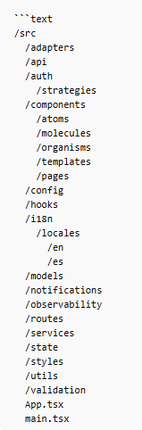

# Caso 1 - Diseño de Software
## DUA streamliner

Problema a resolver:
Diseñar un sistema inteligente que automatice la interpretación de documentos comerciales y genere un DUA prellenado correctamente, reduciendo errores y esfuerzo manual.

Santiago Calderón Zúñiga

Fabricio Monge

# DUA Streamliner

The current process of preparing the DUA is highly manual, time-consuming, and error-prone for importers and exporters. Information required to complete the document is typically scattered across multiple files such as Excel sheets, Word documents, PDFs, and scanned invoices. These documents often follow different structures and formats, making data extraction complex and heavily dependent on human interpretation. As a result, customs specialists spend significant time consolidating, validating, and transcribing information into the official template.

To address this challenge, the proposed solution is an automated system that requires only a folder path containing all relevant documents. The system will intelligently read multiple formats, extract both structured and unstructured data—including OCR from scanned images—and apply AI-driven semantic interpretation tailored to customs terminology. It will then automatically map the extracted information to the official DUA template defined by the Ministerio de Hacienda, validate basic consistency rules, and flag ambiguous or low-confidence fields for review.

The expected result is a fully pre-filled Word DUA document with visual confidence indicators that guide expert validation. This approach does not eliminate the customs specialist’s role but transforms it into a strategic review function, significantly reducing manual operational workload. Ultimately, the system aims to increase efficiency, reduce errors, accelerate processing times, and improve compliance accuracy in international trade operations.

# Frontend Design
The following are the aspects that must be covered in the frontend design proposal for case #1. The readme.md after the cover page would start with a level 1 title:

# 1. Frontend Design
## 1.1 Technology stack:
- Application type: Web Application (SPA)
- Web framework: React 19.2.0
- Web server: Node.js 21.7.1
- Coding Language: TypeScript 5.9.3
- Unit testing framework: Jest 30.2.0
- Data validation framework: Zod 4.3.6
- Code prettier framework: Prettier 3.8.1
- Code style framework: ESLint 10.0.2
- Integration testing tools: Playwright 1.58.2
- Cloud service: Azure Cloud Services
- Hosted services within the cloud service: Azure App Service
- Code repositories service: Azure DevOps Repositories
- Code automation task tool: Husky 9.1.7
- CI CD pipelines technology: Azure DevOps Pipelines
- Environments: Development, Staging, Production
- Environment deployments tools: Azure DevOps Environments
- Observability framework: Azure Application Insights SDK

## 1.2 UX UI analysis:

### Core Business Process
Describe what happens on each screen in terms of actions (excluding visual components, only user actions, and the result of each action)
#### Login
1. The user enters their login credentials (username, password)
2. If the login attempt fails, a message is displayed indicating whether the username or password is invalid.
3. If the login is successful, the process proceeds to the next page using the credentials entered by the user.
 

#### Configuring the Generator
1. The user selects to configure the DUA generator.
2. A folder path containing documents to be analyzed is requested.
3. The user enters the desired path.
4. A document to use as a template is requested.
5. The user enters a DUA template document.
 

#### Progress Monitoring
1. The user initiates the DUA generation process after providing the source folder and template.
2. The system begins reading documents, detecting formats, extracting text, performing OCR when necessary, and mapping relevant fields.
3. The user monitors the current status of the process.
4. The system reports the current execution stage, the documents detected, completed tasks, and pending tasks.
5. The user reviews warnings related to missing data, ambiguous fields, or low-confidence extractions.
6. The system indicates which information requires manual validation before generating the final document.
7. The user waits for the process to finish or for the system to indicate that further review is needed.
8. Once processing is complete, the system makes the result available for review and export.
 

#### Obtaining Results
1. the user decides to export the work done to a file
2. the user decides witch type of file, as a pdf or a docx
3. the system takes the information gathered and fills a docx 
4. the system hands the document in the type of file that was specified by the user 
 

#### Logout 
1. The user decides to log out.
2. Confirmation is requested before logging out.
3. If confirmation is denied, the user remains in the current window.
4. If confirmation is given, the current session is closed and the user is redirected to the login page.
 

#### Wireframes

#### UX test results

#### Participant 1
- Screen understanding: The participant understood the screen overall, but did not fully read all instructions during the first pass.
- Hesitation point: The main hesitation occurred at the beginning of the process.
- Time on task: Approximately 5 to 10 minutes.
- Task completion: Yes.
- User comment: The participant described the flow as interesting and understood that the system analyzes documents and later allows exporting the result.
  
#### Participant 2
- Screen understanding: The participant understood the screen without problem, but feels there could be more guidance.
- Hesitation point: The main hesitation occurred at the viewing of the document reading section.
- Time on task: Approximately 5 minutes.
- Task completion: Yes.
- User comment: The participant understood the app analyzes documents and generates a resulting document.
  
#### Participant 3
- Screen understanding: The participant said he thinks its easy to understand the screen.
- Hesitation point: The main hesitation occurred at the route selections.
- Time on task: less than 4 minutes.
- Task completion: Yes.
- User comment: The user said "there should be an option to close the app or get back to the options menu."
  
#### Participant 4
- Screen understanding: The participant said he thinks its not very easy to understand without any other information.
- Hesitation point: The main hesitation occurred at at the viewing of the document reading section.
- Time on task: less than 4 minutes.
- Task completion: Yes.
- User comment: The user said there should be more context.
  
#### Participant 5
- Screen understanding: The participant said he understood in general.
- Hesitation point: The main hesitation occurred at at the viewing of the document scanning section.
- Time on task: 10 minutes maximum.
- Task completion: Yes.
- User comment: The user has no comment.

## 1.3 Component design strategy:

### Design principles
- Shared reusable components.
- Clear component responsibility.
- Consistent UI behavior.
- Basic accessibility practices.

### Component architecture
- Atomic Design.
- Structure: atoms, molecules, organisms, templates, pages.
- Shared components under `/src/components`.
- Feature screens reuse shared components first.

- Atomic design: 

### Styling and branding
- CSS Modules.
- Shared design tokens for color, typography, spacing, radius, and elevation.
- Branding enforced through reusable primitives.

### Internationalization
- All visible text is externalized.
- `react-i18next` for multilingual support.
- Translations organized by language and domain.

### Responsiveness
- Mobile-first approach.
- Support for mobile, tablet, and desktop.
- Flexible layouts and relative units.

## 1.4 Security

### Security model
- Single web application
- Single Sign-On (SSO) with Azure Active Directory
- Azure Active Directory as identity provider and credential server

### Authentication
- Azure Active Directory (Azure AD)
- OAuth 2.0 / OpenID Connect
- MFA (multifactor authentication) by using Azure AD
- Backend-for-Frontend (BFF) token flow
- Location: `/src/auth/AuthProvider.tsx`, `/src/auth/AuthService.ts`

### Authorization
- Role-Based Access Control (RBAC) defined in Azure AD
- Role and permission validation before protected routes and actions
- Location: `/src/auth/PermissionGuard.tsx`, `/src/auth/authorization.ts`

### Session, storage and cache
- Session handled in the BFF layer
- Secure HttpOnly cookies for session storage
- No tokens stored in localStorage
- No-store cache for sensitive views
- Location: `/src/auth/session.ts`, `/src/api/httpClient.ts`

### Secured communication
- TLS 1.2+ : HTTPS encryption
- HSTS (HTTP Strict Transport Security)
- CORS (Cross-Origin Resource Sharing)

### Validation
- Client validation: Zod
- Azure Defender to scan uploaded files

### Document management
- Azure Functions for OCR and data extraction
- Managed Identity for authentication without credentials
- HTTPS for document downloading
- Azure Blob Storage

### Data protection
- Azure Storage Encryption: server side encryption
- Azure Key Vault: encryption keys management
- Managed Identity: access to key vault
- Must comply with the Costa Rican Data Protection Law
- Must comply with GDPR (General Data Protection Regulation)

### Monitorization
- Azure Application Insights to capture authentication and authorization events
- Azure Log Analytics to store logs
- Azure Monitor to get warnings in real time

### Safe developing
- Dependency management: Snyk, Dependabot
- Code analysis: SonarQube, Microsoft Security Code Analysis, ESLint
- Pre-commit hooks: Husky, git-secrets
- Dynamic tests: Playwright, penetration tests

### Security structure
- Virtual net
- Net security groups
- Private endpoints
- Managed Identity
- IP restrictions
- Azure Backup

## 1.5 Layered design

### Layers
- Authentication layer
- Authorization layer
- Components layer
- Hooks layer
- Business logic layer
- State management layer
- Data validation layer
- API clients layer
- Notification layer
- Models layer
- Settings layer
- Utils layer
- Observability layer
- Testability layer

### Execution flow
- The frontend initializes the application.
- Authentication validates the current session.
- Authorization validates role and permissions.
- Components render the requested screen.
- Hooks trigger UI actions.
- Business logic orchestrates frontend workflows.
- State management updates session and UI state.
- Data validation validates input and API responses.
- API clients call backend and external services.
- Notification layer receives asynchronous updates.
- Observability records logs and events.

### Detected gaps
- Routing layer not yet defined.
- Testability layer not yet represented in the diagram.
- Observability layer not yet represented in the diagram.

## 1.6 Design patterns

- Strategy — `/src/auth/strategies` — token protection changes over time.
- Observer — `/src/notifications` — notification reception and UI refresh.
- Singleton — `/src/api/ApiGateway.ts`, `/src/config/AppSettings.ts`, `/src/state/store.ts` — single shared instances.
- Facade — `/src/api/DuaApiFacade.ts` — reduces API client proliferation.
- Factory Method — `/src/factories` — object creation for frontend domain models.
- Adapter — `/src/adapters` — response and format normalization.

## 1.7 a folder in /src that contains the project scaffold, which is generated from all the specifications in points 1.1 to 1.6.

# Backend design

## Technology stack
- REST API over HTTPS
- API standard with OpenAPI
- Azure API Management + Azure App Service
- Azure Functions for long-running processing
- Azure Blob Storage for source files, templates, and generated outputs
- Azure SQL Database for relational data and job metadata
- Azure Service Bus for asynchronous processing
- Azure Web PubSub for real-time monitoring updates
- Azure Key Vault for secrets and certificates
- API coding language: C#
- Backend framework: ASP.NET Core
- This is a monorepo solution, sharing the repository with the frontend, backend folder: `duabusiness`
- Architecture style: modular monolith with background workers
- Execution model:
  - synchronous for authentication, template setup, job creation, status queries, and result download
  - asynchronous for OCR, semantic extraction, validation, and DUA generation
- No standalone load balancer is introduced in v1

## Security
- This section must stay aligned with the frontend security model
- Authentication: Microsoft Entra ID
- Authentication protocol: OAuth 2.0 / OpenID Connect
- Authorization model: RBAC
- The backend must enforce the same business roles defined in the frontend
- Session validation must remain compatible with the frontend session model
- HTTPS only
- TLS 1.2 or higher
- Database encryption at rest: Azure SQL TDE with AES-256
- Secrets, certificates, and keys stored in Azure Key Vault
- Uploaded files stored in private Blob containers
- No public access to uploaded or generated files
- General maximum payload size: 10 MB
- File upload endpoints: up to 250 MB per file using streaming upload
- Default rate limit: 60 requests per minute per authenticated user
- Stricter throttling for login and job creation endpoints
- Active production data retention: 90 days
- Archived files retention: 365 days unless legal hold is required

## Observability
- This section must stay aligned with the frontend observability model
- Platform: Azure Monitor, Application Insights, Log Analytics
- Instrumentation: OpenTelemetry
- Structured logs in JSON format
- Correlation IDs required: `traceId`, `requestId`, `jobId`

### Events to register
- User authentication succeeded / failed
- Job created
- File uploaded
- File validation failed
- File stored
- OCR started / completed / failed
- Semantic extraction started / completed / failed
- Mapping completed
- Validation warning generated
- Manual review required
- Result generated
- Result downloaded
- Job canceled
- Unhandled exception
- Rate limit exceeded
- Access denied

### Dashboards
- Operational dashboard
- Security dashboard
- Business processing dashboard

## Infrastructure (devops)
- Source control: Azure DevOps Repositories
- CI/CD automation: Azure DevOps Pipelines
- Environment coordination: Azure DevOps Environments
- Infrastructure as Code: Bicep
- Environments:
  - `dev`
  - `stage`
  - `prod`
- Deployment strategy:
  - `dev`: automatic
  - `stage`: automatic after integration validation
  - `prod`: manual approval
- Pipeline stages:
  - build
  - static analysis
  - unit tests
  - integration tests
  - package
  - infrastructure deployment
  - application deployment
  - smoke tests

## Availability
- Availability target for v1: 99.95% annual uptime
- Maximum annual downtime budget: approximately 4 hours 23 minutes
- Main reliability measures:
  - managed Azure services with SLA
  - queue-based decoupling for long-running jobs
  - retry and backoff policies
  - idempotent background processing
  - dead-letter handling for failed messages
  - storage redundancy
- Single points of failure must be reviewed for:
  - API gateway
  - App Service
  - SQL Database
  - Blob Storage
  - Service Bus
  - Web PubSub
- Any element that does not meet the target reliability must include an explicit recovery strategy

## Scalability
- Elements that grow when request volume increases:
  - API Management capacity
  - App Service instances
  - Azure Functions concurrency
  - Service Bus queue depth
  - Blob Storage throughput
  - SQL Database load
  - Web PubSub concurrent connections
- Scaling strategy:
  - stateless API layer
  - queue-based processing for heavy workloads
  - asynchronous workers for OCR and extraction
  - storage separated from compute
  - monitoring traffic separated from main API traffic

## Backend key workflows

### Upload files to generate dua
1. The frontend requests a new DUA generation job
2. The backend creates a `jobId`
3. The client uploads files using streaming transfer
4. The backend validates file type, size, and metadata
5. Files are stored in Azure Blob Storage
6. File metadata is persisted in Azure SQL Database
7. The backend publishes processing messages to Azure Service Bus
8. Worker components process the job asynchronously
9. Progress updates are published to the monitoring channel
10. The backend updates the job state until completion, review required, or failure

### Setup dua template
1. The user selects or uploads a DUA template
2. The backend validates template type and version
3. The template is stored in protected Blob Storage
4. Template metadata is stored in the database
5. The template is linked to the current job or reusable configuration

### Process documents
1. A worker loads the job context and related files
2. The worker selects the correct parser for each file type
3. OCR is executed when required
4. Extracted data is normalized into a common internal model
5. Semantic extraction identifies DUA-relevant fields
6. Mapping rules assign values to DUA target fields
7. Validation rules detect inconsistencies and low-confidence values
8. The backend marks the job as completed, failed, or review required

### Generate and deliver result
1. The backend builds the final DUA output document
2. The generated file is stored in Blob Storage
3. The backend stores the output reference and final job state
4. The frontend receives a completion update
5. The user requests the result file
6. The backend authorizes the request and returns a secure download response

## Architecture diagrams in layers
- Follow the C4 standard to create the diagrams and explanations
- Include:
  - Context diagram
  - Container diagram
  - Code diagram
- In this deliverable, no component diagram is included

## Design Considerations
- System parameters and policies must be documented in source code
- Resource allocation decisions must be explicit
- Core business algorithms and their parameters must be documented
- AI-assisted extraction components must remain configurable
- Internal integrations must be abstracted behind interfaces
- Sensitive data must never be written to logs
- Manual review must remain part of the business flow for low-confidence results

## Source Code
- The backend skeleton must be generated from this technical description
- The generated scaffold must not include final business logic
- The backend structure must follow the chosen repository architecture
- The README must provide direct links to the main folders and primary classes

### Suggested structure
- `/duabusiness/src/Api`
- `/duabusiness/src/Application`
- `/duabusiness/src/Domain`
- `/duabusiness/src/Infrastructure`
- `/duabusiness/src/Workers`
- `/duabusiness/src/Contracts`
- `/duabusiness/src/Observability`
- `/duabusiness/tests/Unit`
- `/duabusiness/tests/Integration`

### Suggested primary classes
- `/duabusiness/src/Api/Controllers/DuaJobsController.cs`
- `/duabusiness/src/Api/Controllers/TemplatesController.cs`
- `/duabusiness/src/Application/Jobs/CreateDuaJobService.cs`
- `/duabusiness/src/Application/Jobs/GetJobStatusService.cs`
- `/duabusiness/src/Application/Files/RegisterUploadedFileService.cs`
- `/duabusiness/src/Application/Templates/SetTemplateService.cs`
- `/duabusiness/src/Application/Results/GenerateResultDocumentService.cs`
- `/duabusiness/src/Workers/Processing/ProcessDuaJobFunction.cs`
- `/duabusiness/src/Workers/Processing/RunOcrFunction.cs`
- `/duabusiness/src/Infrastructure/Messaging/JobQueuePublisher.cs`
- `/duabusiness/src/Infrastructure/Storage/BlobStorageService.cs`
- `/duabusiness/src/Infrastructure/Persistence/DuaDbContext.cs`