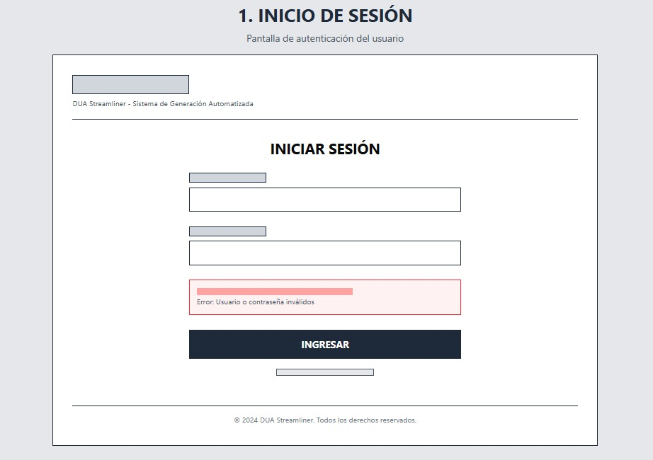
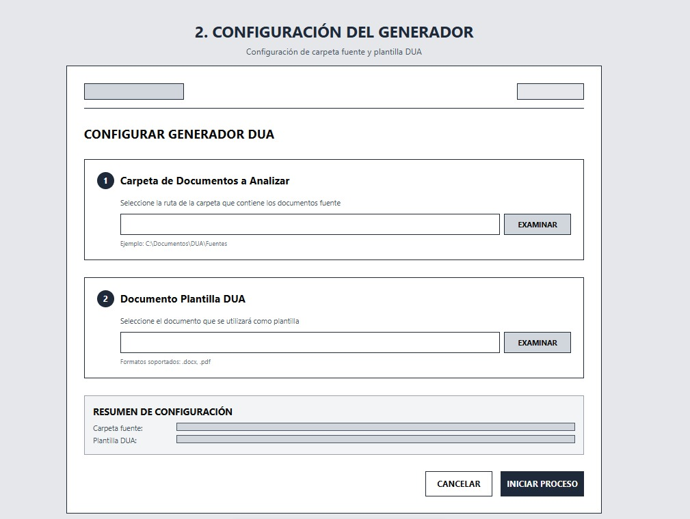
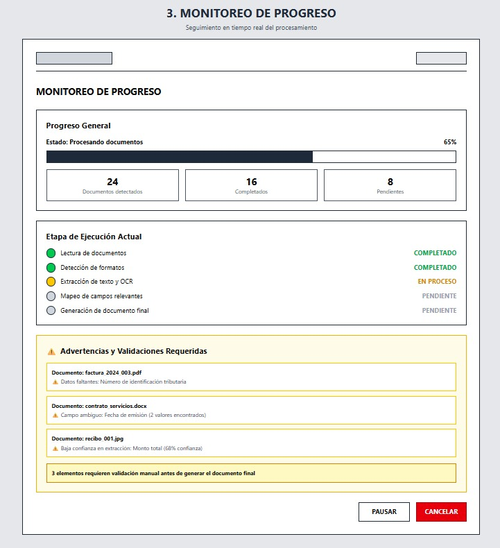
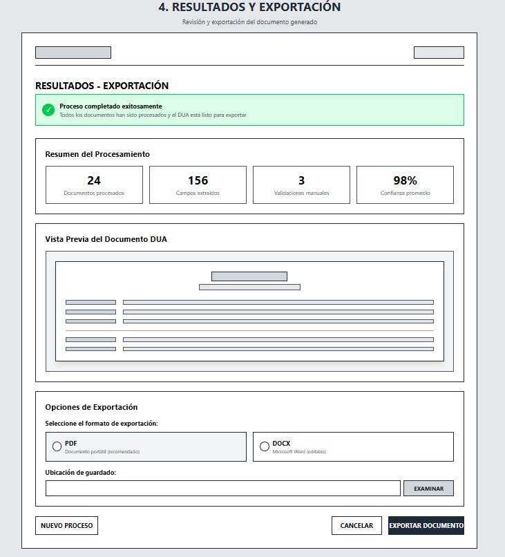
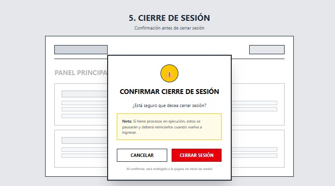
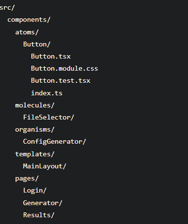

# Caso 1 - Diseño de Software
## DUA streamliner

Problema a resolver:
Diseñar un sistema inteligente que automatice la interpretación de documentos comerciales y genere un DUA prellenado correctamente, reduciendo errores y esfuerzo manual.

Santiago Calderón Zúñiga

Fabricio Monge

# DUA Streamliner

The current process of preparing the DUA is highly manual, time-consuming, and error-prone for importers and exporters. Information required to complete the document is typically scattered across multiple files such as Excel sheets, Word documents, PDFs, and scanned invoices. These documents often follow different structures and formats, making data extraction complex and heavily dependent on human interpretation. As a result, customs specialists spend significant time consolidating, validating, and transcribing information into the official template.

To address this challenge, the proposed solution is an automated system that requires only a folder path containing all relevant documents. The system will intelligently read multiple formats, extract both structured and unstructured data—including OCR from scanned images—and apply AI-driven semantic interpretation tailored to customs terminology. It will then automatically map the extracted information to the official DUA template defined by the Ministerio de Hacienda, validate basic consistency rules, and flag ambiguous or low-confidence fields for review.

The expected result is a fully pre-filled Word DUA document with visual confidence indicators that guide expert validation. This approach does not eliminate the customs specialist’s role but transforms it into a strategic review function, significantly reducing manual operational workload. Ultimately, the system aims to increase efficiency, reduce errors, accelerate processing times, and improve compliance accuracy in international trade operations.

# Frontend Design
The following are the aspects that must be covered in the frontend design proposal for case #1. The readme.md after the cover page would start with a level 1 title:

# 1. Frontend Design
## 1.1 Technology stack:
- Application type: Web Application (SPA)
- Web framework: React 19.2.0
- Web server: Node.js 21.7.1
- Coding Language: TypeScript 5.9.3
- Unit testing framework: Jest 30.2.0
- Data validation framework: Zod 4.3.6
- Code prettier framework: Prettier 3.8.1
- Code style framework: ESLint 10.0.2
- Integration testing tools: Playwright 1.58.2
- Cloud service: Azure Cloud Services
- Hosted services within the cloud service: Azure App Service
- Code repositories service: Azure DevOps Repositories
- Code automation task tool: Husky 9.1.7
- CI CD pipelines technology: Azure DevOps Pipelines
- Environments: Development, Staging, Production
- Environment deployments tools: Azure DevOps Environments
- Observability framework: Azure Application Insights SDK

## 1.2 UX UI analysis:

### Core Business Process
Describe what happens on each screen in terms of actions (excluding visual components, only user actions, and the result of each action)
#### Login
1. The user enters their login credentials (username, password)
2. If the login attempt fails, a message is displayed indicating whether the username or password is invalid.
3. If the login is successful, the process proceeds to the next page using the credentials entered by the user.
 

#### Configuring the Generator
1. The user selects to configure the DUA generator.
2. A folder path containing documents to be analyzed is requested.
3. The user enters the desired path.
4. A document to use as a template is requested.
5. The user enters a DUA template document.
 

#### Progress Monitoring
1. The user initiates the DUA generation process after providing the source folder and template.
2. The system begins reading documents, detecting formats, extracting text, performing OCR when necessary, and mapping relevant fields.
3. The user monitors the current status of the process.
4. The system reports the current execution stage, the documents detected, completed tasks, and pending tasks.
5. The user reviews warnings related to missing data, ambiguous fields, or low-confidence extractions.
6. The system indicates which information requires manual validation before generating the final document.
7. The user waits for the process to finish or for the system to indicate that further review is needed.
8. Once processing is complete, the system makes the result available for review and export.
 

#### Obtaining Results
1. the user decides to export the work done to a file
2. the user decides witch type of file, as a pdf or a docx
3. the system takes the information gathered and fills a docx 
4. the system hands the document in the type of file that was specified by the user 
 

#### Logout 
1. The user decides to log out.
2. Confirmation is requested before logging out.
3. If confirmation is denied, the user remains in the current window.
4. If confirmation is given, the current session is closed and the user is redirected to the login page.
 

#### Wireframes

#### UX test results

## 1.3 Component design strategy:
### design principles
- Reusability: Shared UI elements are abstracted into a common library.
- Composition: Complex interfaces are built by composing smaller, focused components.
- Accessibility: WCAG 2.1 AA compliance using semantic HTML and ARIA.
- Declarative & Predictable: Clear separation of props, state, and side effects.  
- Styling made by CSS modules  
### design architecture
- Atomic design
  

### state management
- React functionalities for local state management
- React context API for shared data 
- React Hook Form with Zod for validation
### internationalisation
-Library: i18next with react-i18next
- JSON files per language
- automatic language detection 
### responsiveness
- mobile first approach
### component documentation
- All atoms, molecules, and organisms are documented in storybook
- chromatic
### code quality
- ESLint & Prettier
- husky pre-commit hooks
### testing
- Jest+React testing library for individual components
- Integration Tests & Accessibility Tests

## 1.4 Security:
### authentication
- Azure Active Directory (Azure AD)
- OAuth 2.0/ OpenID Connect
- MFA (multifactor acthentication) by using Azure AD
- Role-Based Access Control (RBAC) defined in Azure AD
- Tokens Backend for Frontend
### secured comunication 
- TLS 1.2+ : HTTPS cyphering 
- HSTS (HTTTP Strict Transport Security)
- CORS (Cross-Origin Resource Sharing)
### validación 
- client validation: zod
- Azure Defender to scan uploaded files
### Document management
- Azure Functions for OCR and data extraction
- Managed Identity for authentication without credentials
- https for document downloading
- Azure Blob Storage
### Data protection 
- Azure Storage Encryption: server side encryption
- Azure Key Vault: encryption keys management
- Managed Identity: access to key vault
- Must comply with the Costa Rican Data Protection Law
- Must cumply with th GDPR (General Data Protection Regulation)
### monitorization 
- Azure Application Insights to capture authentication and authorization events
- Azure Log Analytics to store logs
- Azure Monitor to get warnings in real time
### safe developing 
- Dependency management: snyk, dependabot
- code analysis: SonarQube, Microsoft security code analysis, ESLint
- pre commit hooks: Husky, git-secrets
- dinamic tests:Playwright, Penetration tests
### security structure
- virtual net
- net security groups
- private endpoints
- Managed Identity
- IP restrictions
- Azure Backup

## 1.5 Layered design:
    // design and explanation of the various layers of the application in the frontend.
    -

## 1.6 Design patterns: 
    // Design of classes with their respective location in the project structure, where it is necessary to apply object-oriented design patterns, such as: security, UI refresh, receiving notifications, state storage, API calls, asynchronous operations, session invalidation, event-driven programming, object creation.
    -

## 1.7 a folder in /src that contains the project scaffold, which is generated from all the specifications in points 1.1 to 1.6.

# Other aspects:

- Everything must be done in English
- Respect Markdown nomenclature, its levels and formats
- Avoid being verbose or filling this technical design documentation with narratives that do not add value to the design

- Remember that the final reader of a design is the system development team and also AI agents that will create the base project, therefore avoid unnecessary explanations

